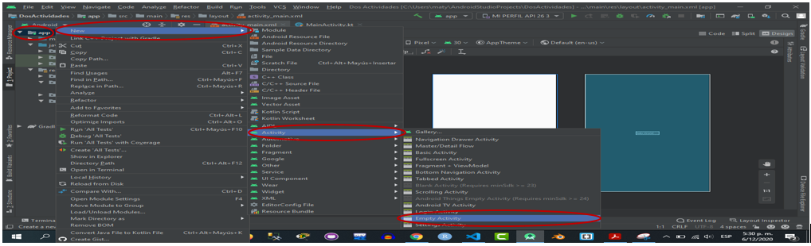

### I. Visión general de la aplicación

* El resultado debe seguir la siguiente lógica:

### Tarea 1.1: Crear el proyecto con dos Activities

* Cree una app con las siguientes características:

Para la creacion de nuestra app nos vamos a inicializar un nuevo proyecto, y luego elegimos la plantilla la cual vamos a utilizar, como en las anteriores usaré Empty Activity.

Luego de esto no envia a otra ventana, en donde vamos a poner el nombre a nuestra aplicación y las condiciones con las cuales debe de contar nuestra aplicación, en donde una vez que los campos sean llenados, damos clic en la opción Finish.

Luego de dar clic en la opcion anterior, nos muestra la interfaz del aplicación.

Y luego de eso podemos ver la ingterfa del aplicación.

### Cree la segunda Activity yendo al panel Project > Android y dar clic derecho sobre la carpeta app de su proyecto y dar a New > Activity > Empty Activity, nombre este activity como Segunda

Como lo dice en el enunciado, vamos a dar clic derecho en la opción "app", luego de eso damos clic en "new", en donde se nos abrirá una nueva ventana en donde vamos a buscar la opción "Activity", de igual manera se nos desplegará una nueva venatana en la cual vamos a elegir la opción "Empty Activity".

Y una vez haciendo clic sobre la opción Empty Activity, nos enviará a una nueva ventana, en la cual se debe de realizar el proceso que se realizó al crear la primer app, la cual fue, llenar los campos requeridos.

### Use el mismo nivel de API y el lenguaje de programación Kotlin. Al final crearemos dos Activities con las siguientes características

### Tarea 1.2: Diseñando la primera Activity

### Detallando las propiedades del activity_main

* Abra activity_main.xml desde el panel Proyecto > Android si aún no está abierto. Si la pestaña Design (diseño) aún no está seleccionada, haga clic en ella.

### A continuación, se le presenta la estructura del activity, su trabajo será diseñar en base a lo mostrado, es posible que no obtenga el mismo diseño solicitado, pero se le recomienda explorar al momento de crear, es libre de diseñar a su manera, pero cuidando la estructura otorgada.

bueno, para diseñar nuestra app, debemos de seguir las siguientes solicitudes, y una de ellas sera, agregar un ConstraintLayout, para eso, damos clic en la opcion antes mencionada

luego de eso, damos clic en la opción que se necesita

Luego que hacemos es arrastrarlo hacia el espacio de trabajo en cual estamos trabajando y lo ajustamos.

Seguidamente, vamos a agregar un TextView, el cual lo hacemos de igual manera que lo arrastramos, hacia el espacio de trabajo.

Una vez que tenemos los TextView, debemos de asignarle un mensaje el cual se nos mortrará al momento de que nuestra aplicación haga su depuración.

### Establezca la propiedad visibility a invisible a los TextView del activity_main, estos serán activados en el momento en que la segunda activity le mande un resultado, en primera instancia están ocultos.

Para establecer esta propiedad, buscamos la opción "Visibility", en la cassilla que se encuentra, desplegamos y elegimos la opción "Invisible", esto es para que el texto que hemos ingresado en el textView no se muestre siempre.

### Establezca el evento onClick al botón del activity_main que tiene el identificador btEnviar, puede usar el siguiente código XML. Puede usar la corrección automática para generar el código correspondiente a este manejador de evento.

### En el caso de que no pueda generar el método a través de las correcciones automáticas, tiene la siguiente estructura

### Agregando un Intent al MainActivity.kt

* Abra el fichero MainActivity.kt

### Agregue un object companion dentro de la clase MainActivity, no dentro de algún método, este servirá para simular un objeto estático que no cambia el valor de sus propiedades en toda la aplicación. El valor EXTRA_MESSAGE nos servirá para la clave del extra en el intent.

### Agregue el siguiente código en el método lanzarSegundaActivity, relacionado a la creación de un intent.

### Muestre el resultado en el momento en que la segunda activity fue lanzada

### Regrese a la activity principal e indique que instancias del ciclo de vida del activity se han ejecutado

### Tarea 1.3: Compartiendo datos de Activity principal a la segunda

### Agregue el siguiente código para enviar datos activities, debe reemplazar el código anterior del método lanzarSegundaActivity. Muetre los resultados.

### Modificando la segunda activity para obtener los extras.

* Abra el fichero Segunda.kt para agregar código al método onCreate()

### Obtenga el intent que activó esta activity

### Obtenga la cadena que contiene el mensaje de los extras de Intent usando el valor del objeto creado en la activity principal y obtenerlo usando la clave MainActivity.EXTRA_MESSAGE:

### Use findViewById() para obtener la referencia del TextView para el mensaje del layout.

### Establezca el texto del TextView con la cadena obtenida del extra del intent

### Ejecute la aplicación. Cuando escriba el mensaje en el MainActivity, haga clic en el botón Enviar, se lanza la SegundaActivity y se muestra el mensaje

* Muestre resultados a través de capturas de pantalla y comentarios

